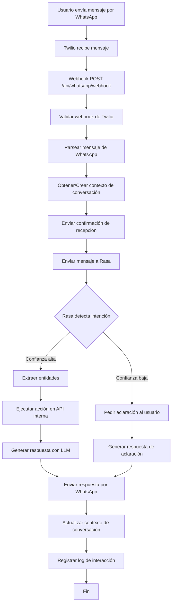
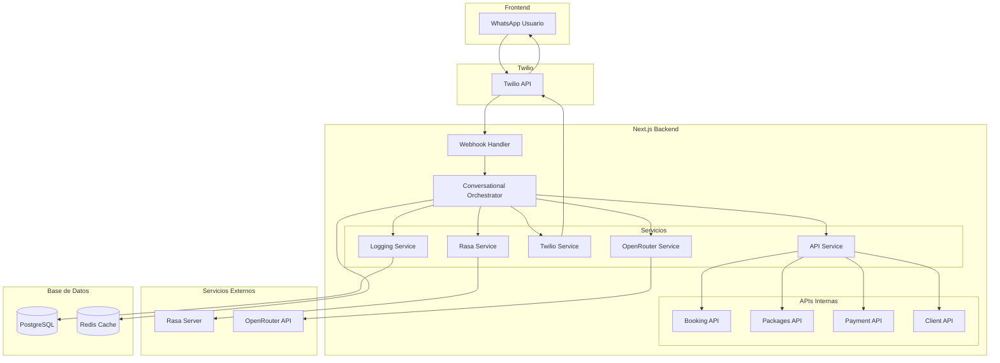
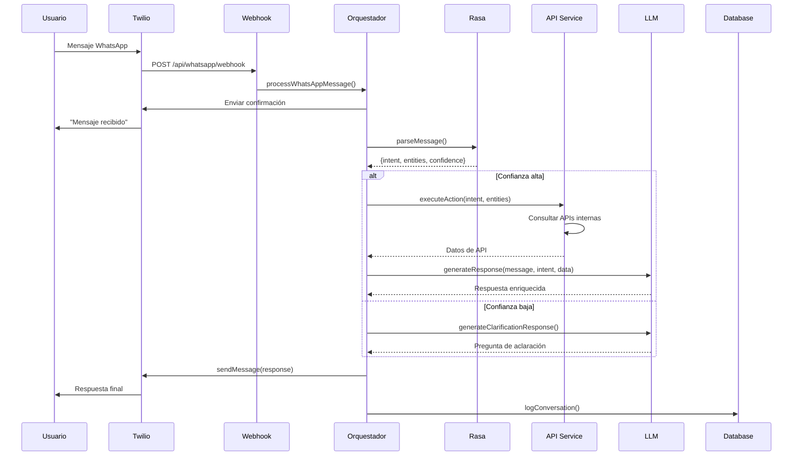
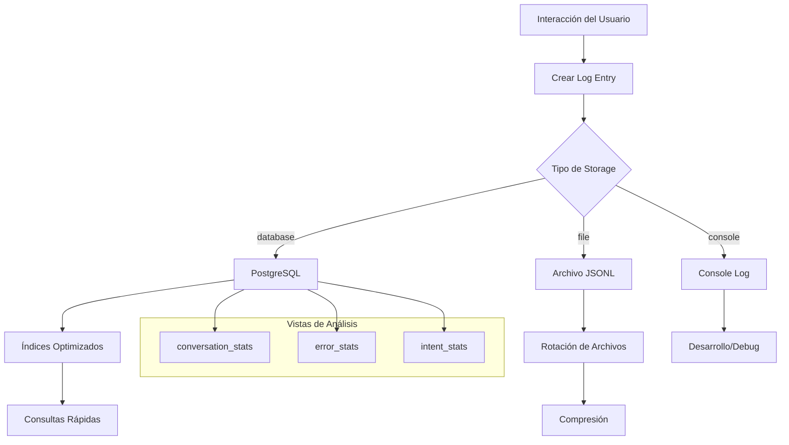
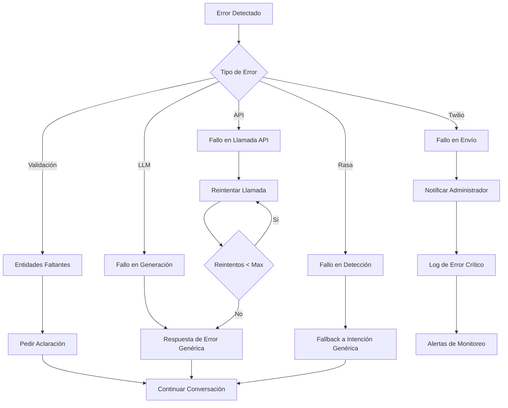
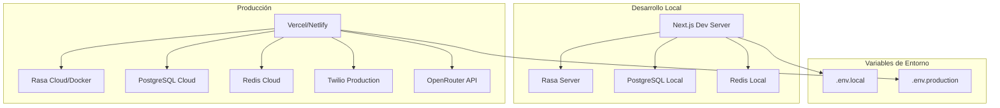
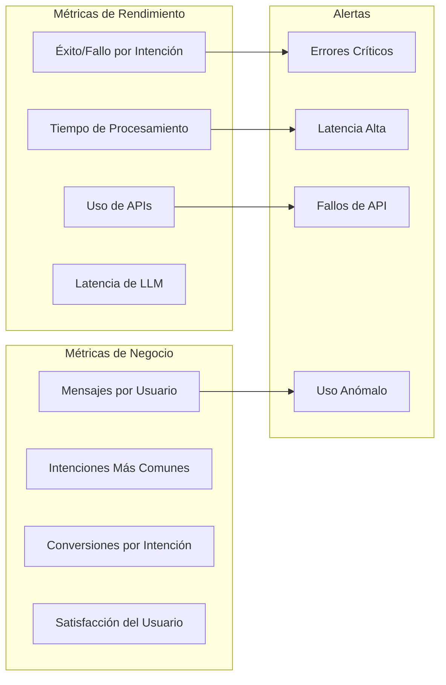

# Diagrama de Flujo del Orquestador Conversacional

## Flujo Principal del Sistema



## Arquitectura de Servicios



## Flujo de Procesamiento de Mensaje



## Mapeo de Intenciones a Acciones

```mermaid
graph LR
    subgraph "Intenciones Rasa"
        I1[consulta_estado]
        I2[agendar_cita]
        I3[consultar_paquetes]
        I4[pagar_servicio]
        I5[cancelar_cita]
        I6[consultar_historial]
        I7[consultar_horarios]
        I8[actualizar_perfil]
        I9[saludo]
        I10[despedida]
        I11[ayuda]
    end
    
    subgraph "Acciones API"
        A1[consultar_estado]
        A2[agendar_cita]
        A3[consultar_paquetes]
        A4[pagar_servicio]
        A5[cancelar_cita]
        A6[consultar_historial]
        A7[consultar_horarios]
        A8[actualizar_perfil]
        A9[saludo]
        A10[despedida]
        A11[ayuda]
    end
    
    subgraph "Endpoints API"
        E1[/admin/bookings]
        E2[/booking]
        E3[/packages]
        E4[/client/purchase]
        E5[/client/bookings]
        E6[/client/purchase-history]
        E7[/schedule-slots]
        E8[/client/me]
        E9[Respuesta directa]
        E10[Respuesta directa]
        E11[Respuesta directa]
    end
    
    I1 --> A1 --> E1
    I2 --> A2 --> E2
    I3 --> A3 --> E3
    I4 --> A4 --> E4
    I5 --> A5 --> E5
    I6 --> A6 --> E6
    I7 --> A7 --> E7
    I8 --> A8 --> E8
    I9 --> A9 --> E9
    I10 --> A10 --> E10
    I11 --> A11 --> E11
```

## Sistema de Logging



## Manejo de Errores



## Configuración de Despliegue



## Métricas y Monitoreo



Este diagrama muestra la arquitectura completa del sistema de orquestación conversacional, incluyendo todos los flujos de datos, servicios, y procesos de manejo de errores.
